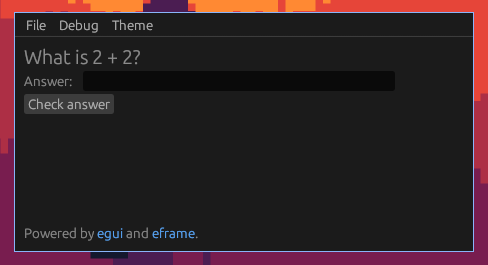

# TomlTasks

A basic quiz made in Rust using [eframe](https://crates.io/crates/eframe).



## Usage

Download the latest Artifact from [GitHub Actions](https://github.com/zax71/tomltasks/actions) and run, navigate to `File > Open` then select a JSON file with the following schema and enjoy your quiz!

```json
{
  "set_name": "Example set",
  "questions": [
    {
      "question": "What is 2 + 2?",
      "answers": ["4", "fish", "four"]
    },
    {
      "question": "What is 1 + 1?",
      "answers": ["window", "2", "two"]
    }
  ]
}
```

## Development

Just like any other Rust project, you can run this with `cargo run`, but `eframe` has some dependencies, here's how to install them

- **Nix:** `use flake` or `direnv allow`
- **Debian:** `sudo apt-get install libxcb-render0-dev libxcb-shape0-dev libxcb-xfixes0-dev libxkbcommon-dev libssl-dev`
- **Fedora:** `dnf install clang clang-devel clang-tools-extra libxkbcommon-devel pkg-config openssl-devel libxcb-devel gtk3-devel atk fontconfig-devel`
- **Windows:** Use WSL 🤷
